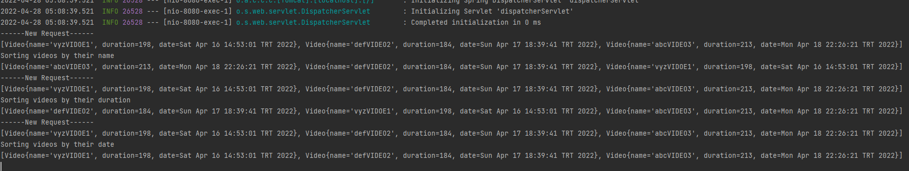
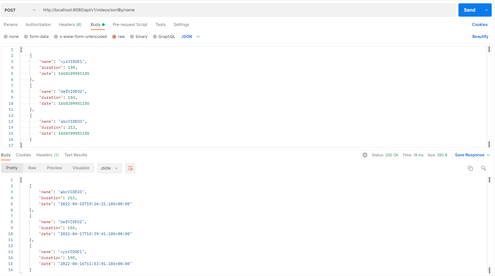
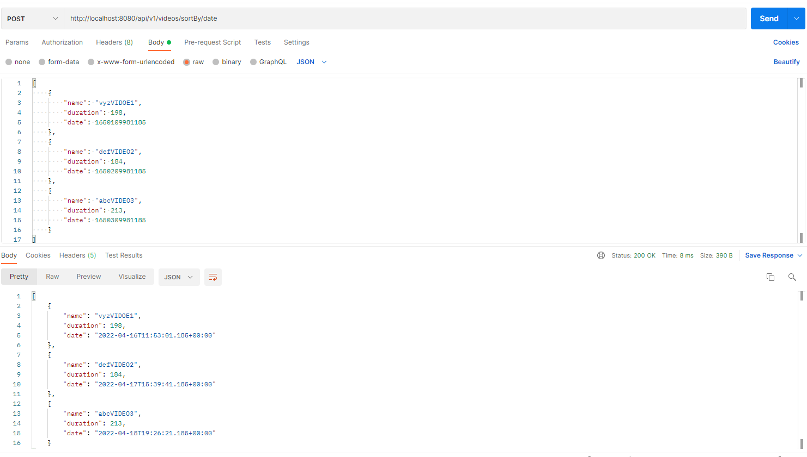

# Video Sorter
Video Sorter is a hands-on java exam for English Central.
It can sort the videos by their name, durations and dates.
## Requirements
For englishCentral spring JDK 17 or newer is required.
## Installation and Run
`git clone https://github.com/MuhammedBeyhanUS/englishCentral.git`

`cd englishCentral`

`mvn install`

`mvn spring-boot:run`
## Usage
This application has three end-point.

"http://localhost:8080/api/v1/videos/sortBy/name" 

"http://localhost:8080/api/v1/videos/sortBy/duration" 

"http://localhost:8080/api/v1/videos/sortBy/date"

End Points take list of Video objects.

Video objects have 3 property: name(String), duration(Integer) and date(UTC).

Send post request to end points with body like;

````
[
    {
        "name": "video1",
        "duration": 198,
        "date": 1650109981185
    },
    {
        "name": "video2",
        "duration": 184,
        "date": 1650209981185
    },
    {
        "name": "video3",
        "duration": 213,
        "date": 1650309981185
    }
]
````

You can import /resources/postmanCollection/englishCentral.postman_collection.json to postman and test the endpoints by yourself.

## TO DO
Below improvements will be done when have time.
- print method should not be in the videoSorterService(out of context)
- should have requestObject and responseObject classes(security)
- test codes should be implemented
- in case of new controller, name the Controller class as VideoSorterController
- In controller sort type can be a variable(Enum would be better), so that we can handle all the cases in one end point.
- lombok should be used to avoid the boiler code in Video class.
## The References
 - https://start.spring.io/

## Screen Shots






